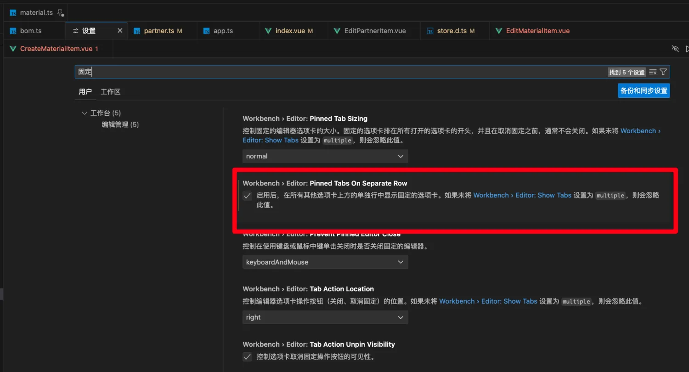

# 0002. 固定的标签换行展示

## 📝 summary

- 在配置中，找到 `Wrokbench > Editor: Pinned Tabs On Separate Row`，将其勾选上。这可以让固定的标签展示在非固定标签的上边，可以更方便地管理固定的标签。
- 在阅读一些大型项目的源码时，通常会将一些比较重要的模块设置为固定标签，以防不小心被关闭掉。
- 如果想要将不重要的标签给关闭掉，可以使用快捷键 `cmd k cmd w` （macOS） `ctrl k ctrl w` （windows） 来关闭，这不会对固定标签有影响。
- 拖拽：将非固定的标签拖到固定标签所在的行，非固定标签就自动转为固定标签。

