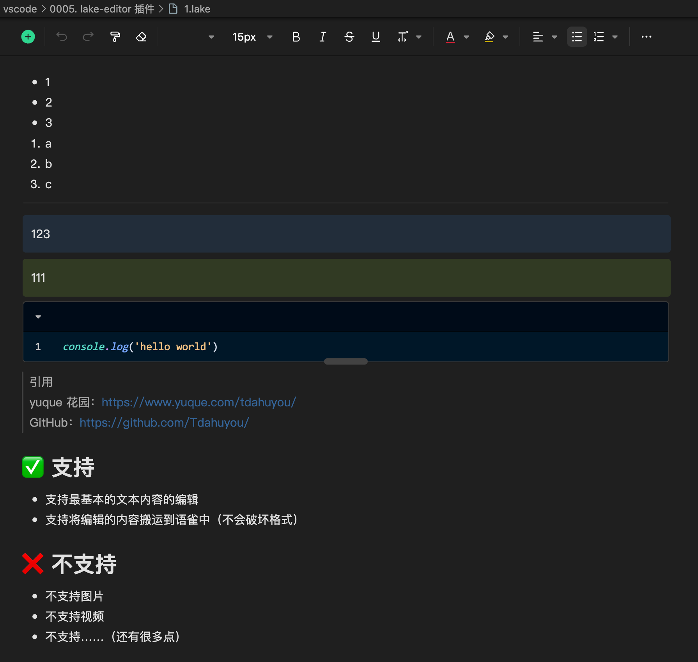

# [0005. lake-editor 插件](https://github.com/Tdahuyou/vscode/tree/main/0005.%20lake-editor%20%E6%8F%92%E4%BB%B6)

- 一款在 vsocde 中编写语雀文档的插件。

## 📒 notes - lake-editor

- lake-editor 插件
  - 
- 问：lake-editor 有啥用？
  - 官方描述：use yuque editor edit local lake file and lakebook viewer
  - lake-editor 可以让你在本地能够使用语雀可视化编辑器，并且编写的内容能够直接搬运到语雀文档中，不会破坏原有的样式、格式。
- 使用流程：
  - 在 VSCode 中搜索 lake-editor 插件并安装好。
  - 在本地新建一个 .lake 文件，比如 `1.lake`。
  - 
- 使用评价：
  - 功能阉割：有很多功能是不支持的，比如插入图片、附件……。
  - 使用场景：如果仅仅是处理一些简单的文本编辑需求，勉强还是可以用一下的。